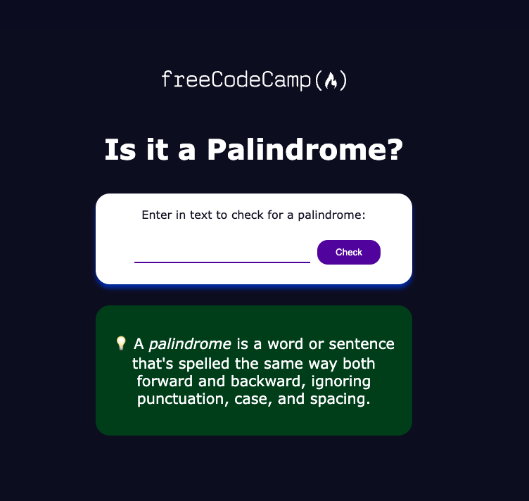

# Palindrome Checker

A palindrome is a word, phrase, number, or other sequence of characters that reads the same forward and backward. This project provides a simple tool to check if a given input text is a palindrome.

## Features

- Removes all non-alphanumeric characters (punctuation, spaces, and symbols) from the input text.
- Converts the input text to the same case (lowercase or uppercase) for comparison.
- Determines if the cleaned input text is a palindrome.

## Usage

To use the palindrome checker:

1. Enter a text string into the input field.
2. Click the "Check" button to determine if the input text is a palindrome.
3. The result will be displayed below the input field, indicating whether the input text is a palindrome or not.

## Technologies Used

- HTML
- CSS
- JavaScript

## How to Contribute

This project was developed as part of the Full Stack Developer certification path on freeCodeCamp. Contributions are not currently being accepted as this project is completed for certification purposes.

## License

This project is licensed under the MIT License - see the [LICENSE](LICENSE) file for details.
